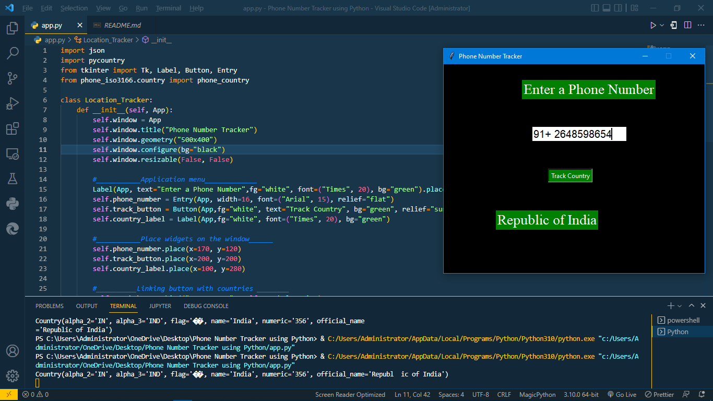

# Python Phone Number Tracker

[]()
[]()

Hi Guys , This just a simple desktop application made using **Tkinter** for them aim of tracking the country through phone number. 

## Let's get started 

First of all just clone the repository using git command or using by clicking download zip button 

```bash 
$-> git clone https://github.com/sandeeprawat28/Python-Phone-Number-Tracker.git
$-> cd Python-phonenumber-tracker-App
$ Python-phonenumber-tracker-App-> 
```

### Requirements 

To successful run this demo application you're required to havesome few libraries installed on your machine 

**Linux installation**
```bash
$~ pip3 install python-tk, pycountry, phone-iso3166
```

**WIndow installation** 

For window you do the same as for linux just without *python-tk* since it come by default with python installation 

**Let's run our App**

Now you're ready to run and begin using the application 

Running our app

```bash
$~ python3 app.py
```

## Output 

You should have the output as hown in the image below 



## Contributing 💚
Contributions, issues and features requests are welcome!

## Show your support ❤️
Give a 🌟 if this project helped you!
